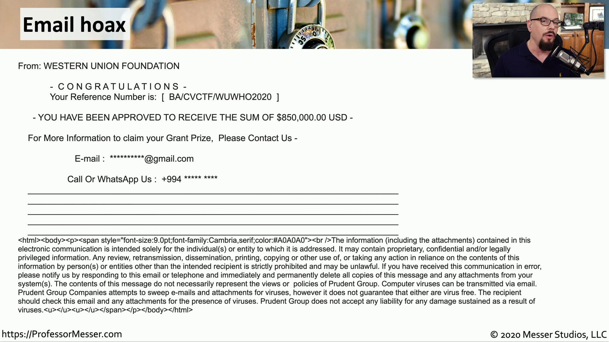
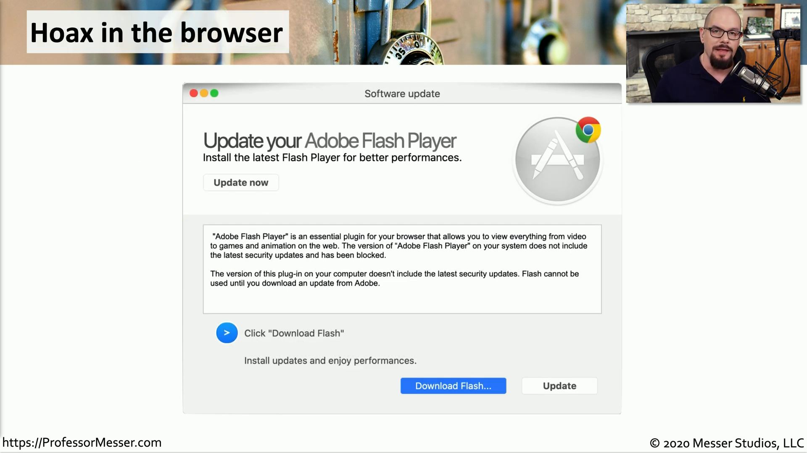

## Computer hoaxes
- A threat that doesn't actually exist
	- But they seem like they COULD be real
- Still often consume lots of resources
	- Forwarded email messages, printed memorandums, wasted time
- Often an email
	- Or Facebook wall post, or tweet, or...
- Some hoaxes will take your money
	- But perhaps not through electronic means
- A hoax about a virus can waste as much time as a regular virus

## Email Hoax

## Hoax in the browser

## De-hoaxing
- It's the internet. Believe no one.
	- Consider the source
- Cross reference
	- http://www.hoax-slayer.net
	- snopes.com
- Spam filters can help
	- There are so many other ways
- If it sounds too good to be true
	- It probably is
