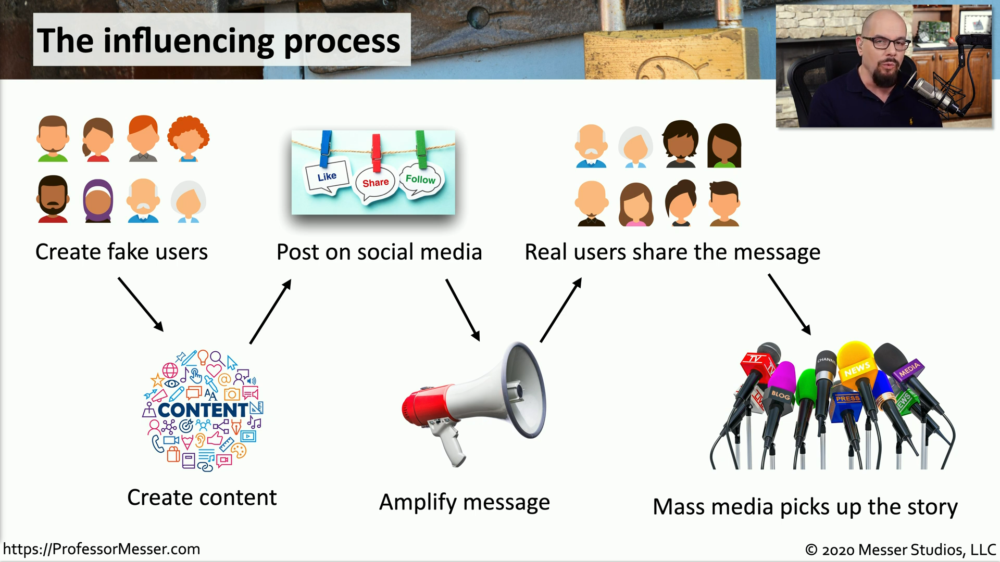

## Hacking public opinion
- Influence campaigns
	- Sway public opinion on political and social issues
- Nation-state actors
	- Divide, distract, and persuade
- Advertising is an option
	- Buy a voice for your opinion
- Enabled through Social media
	- Creating, sharing, liking
	- Amplification

## The influencing process
- Create fake users
	- Create content
		- Post on social media
			- Amplify message
				- Real users share the message
					- Mass media picks up the story

## Hybrid warfare
- Military strategy
	- A broad description of the techniques
	- Wage ware non-traditionally
- Not a new concept
	- The internet adds new methods
- Cyberwarfare
	- Attack an entity with technology
- Influence with a military spin
	- Influencing foreign elections
	- "Fake News"
