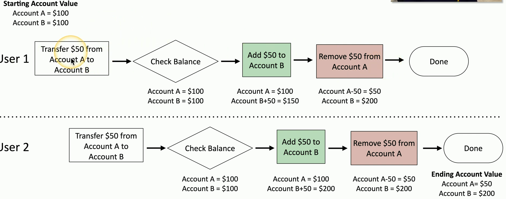

- A programming conundrum
	- Sometimes, thing happen at the same time
	- This can be bad if you've not planned for it
- Time-of-check to time-of-use attack (TOCTOU)
	- Check the system
	- When do you use the results of your last check?
	- Something might happen between the check and the use

## Race condition example

## Race conditions can cause big problems
- January 2004 - Mars rover "Spirit"
	- Reboot when a problem is identified
	- Problem is with the file system, so reboot because of the file system problem
	- Reboot loop was the result
- GE Energy - Energy Management System
	- Three power lines failed at the same time, race condition delayed alerts
	- Caused the Northeast Blackout of 2003
- Therace-25 radiation therapy machine in the 1980s
	- Used software interlocks instead of hardware
	- Race condition caused 100 times the normal does of radiation
	- Six patients injured, three deaths

