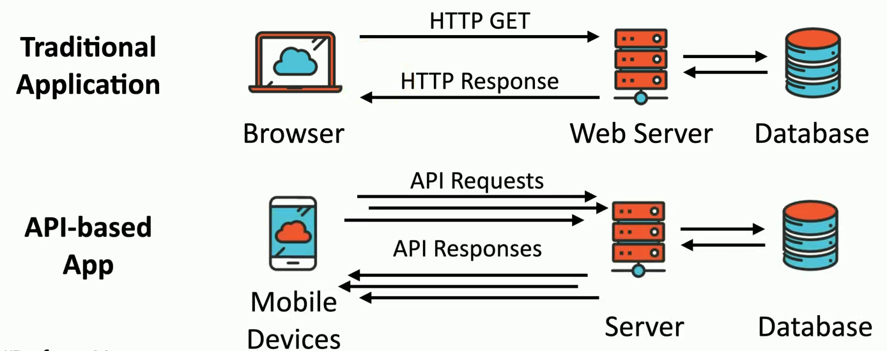

## Memory vulnerabilities
- Manipulation memory can be advantageous
	- Relatively difficult to accomplish
- Memory leak
	- Unused memory is not properly released
	- Begins to slowly grow in size
	- Eventually uses all available memory
	- System crashes

## Memory vulnerabilities
- NULL Pointer dereference
	- Programming technique that references a portion of memory
	- What happens if that reference points to nothing?
		- Application crash, debug information displayed, DoS
- Integer overflow
	- Large number into a smaller sized space
	- Where does the extra number go?
	- You shouldn't be able to manipulate memory this way

## Directory Traversal
- Directory traversal / path traversal
	- Read files from a web server that are outside of the website's file directory
	- Users shouldn't be able to browse the Windows folder
- Web server software vulnerability
	- Won't stop users from browsing past the web server root
- Web application code vulnerability
	- Take advantage of badly written code

`GET http://www.example.com/show.asp?view=../../Windows/system.ini HTTP/1.1`

## Improper error handling
- Errors happen
	- And you should probably know about it
- Messages should just be informational enough
	- Avoid too much detail
		- Network information
		- Memory dump
		- Stack traces
		- Database dumps
- This is an easy one to find and fix
	- A development best-practice

## Improper input handling
- Many applications accept user input
	- We put data in, we get data back
- All input should be considered malicious
	- Check everything
		- Trust nobody
- Allowing invalid input ca be devastating
	- SQL injections, buffer overflows, denial of service, etc...
- It takes a lot of work to find input that can be used maliciously
	- But they will find it

## API attacks
- API - Application Programming Interface
- Attackers look for vulnerabilities in this new communication path
	- Exposing sensitive data, DoS, intercepted communication, privileged access

## Resource exhaustion
- A specialized DoS (Denial of Service) attack
	- May only require one device and low bandwidths
- ZIP Bomb
	- A 42 kilobyte .zip compressed file
		- Uncompressed to 4.5 petabytes (4,500 terabytes)
			- Anti-virus will identify these
- DHCP starvation
	- Attacker floods a network with IP address requests
	- MAC address changes each time
	- DHCP server eventually runs out of addresses
		- Switch configurations can rate limit DHCP requests

