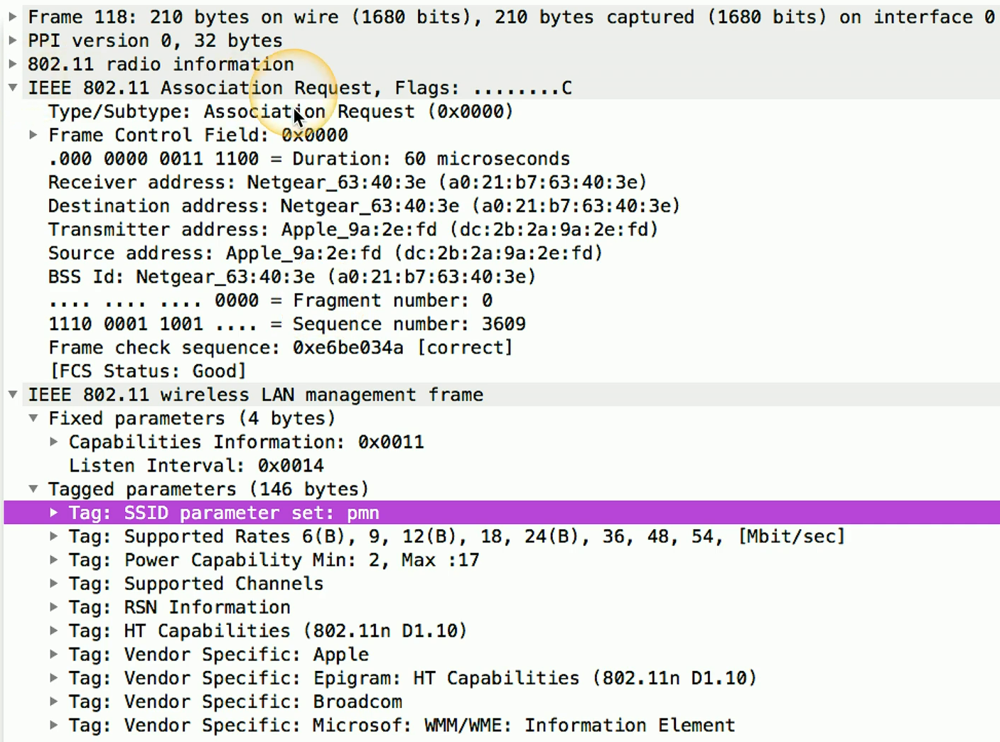
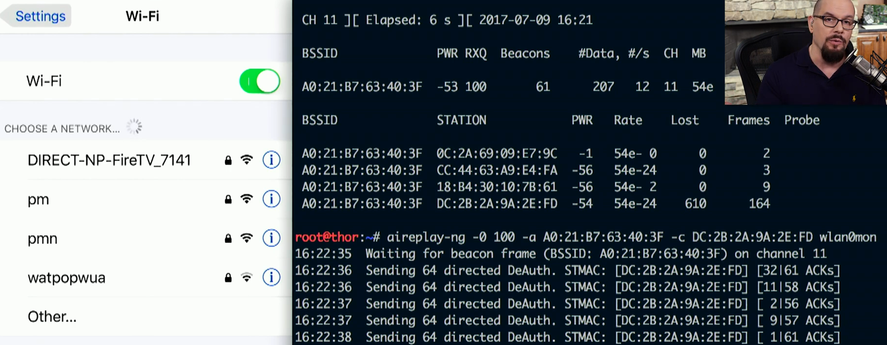

## It started as a normal day
- Surfing along on your wireless network
	- And then you're not
- And this happens again
	- And again
- You may not be able to stop it
	- There's (almost) nothing you can do
	- Time to get a long patch cable (Ethernet)
- Wireless deauthentication
	- A significant wireless denial of service (DoS) attack

## 802.11 management frames
- 802.11 wireless includes a number of management frames
	- Frames that make everything work
	- You never see them
- Important for the operation of 802.11 wireless
	- How to find access points, manage QoS, associate/disassociate with an access point, etc...
- Original wireless standards did not add protection for management frames
	- Sent in the clear
	- No authentication or validation

- DeAuth example

## Protecting against deauth attacks
- IEEE has already addressed the problem
	- 802.11w - July 2014
- Some of the important management frames are encrypted
	- Disassociate, deauthenticate, channel switch announcements, etc...
- Not everything is encrypted
	- Beacons, probes, authentication, association
- 802.11w is required for 802.11ac compliance
	- This will roll out going forward

