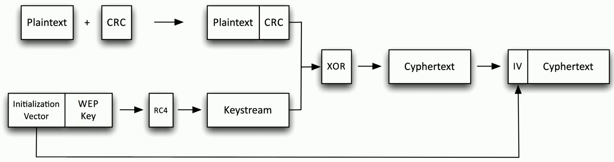

## Cryptography without randomization

## Cryptographic nonce
- Arbitrary number
	- Used once
		- "For the nonce" -For the time being
- A random or pseudo-random number
	- Something that can't be reasonably guessed
	- Can also be a counter
- Use a nonce during the login process
	- Server gives you a nonce
	- Calculate your password hash using the nonce
	- Each password hash sent to the host will be different, so a replay won't work
- A type of nonce
	- Used for randomizing an encryptin scheme
	- The more random, the better
- Used in encryption ciphers, WEP, and some SSL implementations

## Salt
- A nonce most commonly associated with password randomization
	- Make the password hash unpredictable
- Password storage should always be salted
	- Each user gets a different salt

