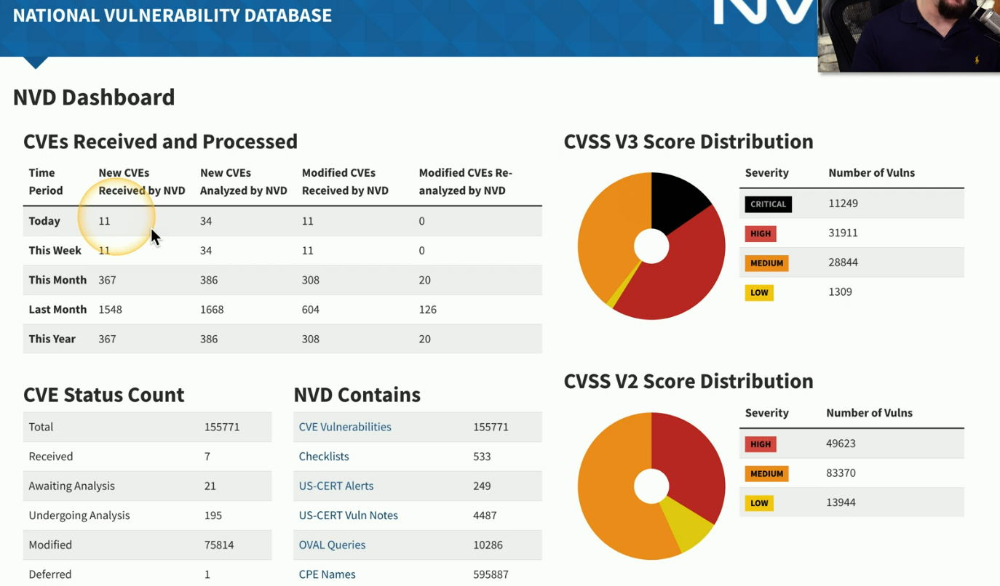
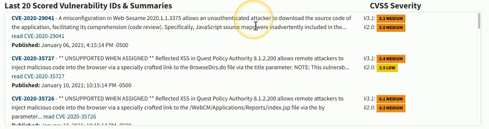

- Research the threats
	- And the threat actors
- Data is everywhere
	- Hacker group profiles, tools sued by the attacks, and much more
- Make decisions based on this intelligence
	- Invest in the best prevention
- Used by researchers, security operations teams, and others

## Open-source intelligence (OSINT)
- Open-source
	- Publicly available sources
	- A good place to start
- Internet
	- Discussion groups, social media
- Government data
	- Mostly public hearings, reports, websites, etc.
- Commercial data
	- Maps, financial reports, databases
## Closed/proprietary intelligence
- Someone else has already compiled the threat information
	- You can buy it
- Threat intelligence services
	- Threat analytics
	- Correlation across different data sources
- Constant threat monitoring
	- Identify new threats
	- Create automated prevention workflows

## Vulnerability databases
- Researches find vulnerabilities
	- Everyone needs to know about them
- Common Vulnerabilities and Exposures (CVE)
	- A community manage list of vulnerabilities
	- Sponsored by the U.S. Department of Homeland Security (DHS) and Cybersecurity and Infrastructure Security Agency (CISA)
- U.S. National Vulnerability Database (NVD)
	- A summary of CVEs
	- Also sponsored by DHS and CISA
		- https://nvd.nist.gov/
- NVD provides additional details over the CVE list
	- Patch availability and severity scoring

## Public/private information-sharing centers
- Public threat intelligence
	- Often classified information
- Private threat intelligence
	- Private companies have extensive resources
- Need to share critical security details
	- Real-time, high-quality cyber threat information sharing
- Cyber Threat Alliance (CTA)
	- Members upload specifically formatted threat intelligence
	- CTA scores  each submission and validates across other submissions
	- Other members can extract the validated data

## Automated indicator sharing (AIS)
- Intelligence industry needs a standard way to share important threat data
	- Share information freely
- Structured Threat Information eXpression (STIX)
	- Describes cyber threat information
	- Includes motivations, abilities, capabilities, and response information
- Trusted Automated eXchange of Indicator Information (TAXII)
	- Securely shares STIX data

## Dark web intelligence
- Dark web
	- Overlay networks that use the internet
	- Requires specific software and configurations to access
- Hacking groups and services
	- Activities
	- Tools and techniques
	- Credit card sales
	- Accounts and passwords
- Monitor forums for activity
	- Company names, executive names

## Indicators of compromise (IOC)
- An event that indicates an intrusion
	- Confidence is high
	- He's calling from inside the house
- Indicators
	- Unusual amount of network activity
	- Change to file hash values
	- Irregular international traffic
	- Changes to DNS data
	- Uncommon login patterns
	- Spikes of read requests to certain files

## Predictive analysis
- Analyze large amounts of data very quickly
	- Find suspicious patterns
	- Big data used for cybersecurity
- Identify behaviors
	- DNS queries, traffic patterns, location data
- Creates a forecast for potential attacks
	- An early-warning system
- Often combined with machine learning
	- Less emphasis on signatures
		- Very large amount of data and trying to analyze

## Threat maps
- Identify attacks and trends
	- View worldwide perspective

## File/code repositories
- See what the hackers are biulding
	- Public code repositories
	- Github
- See what people are accidentally releasing
	- Private code an often be published publicly
- Attackers are always looking for this code
	- Potential exploits exist
	- Content for phishing attacks

