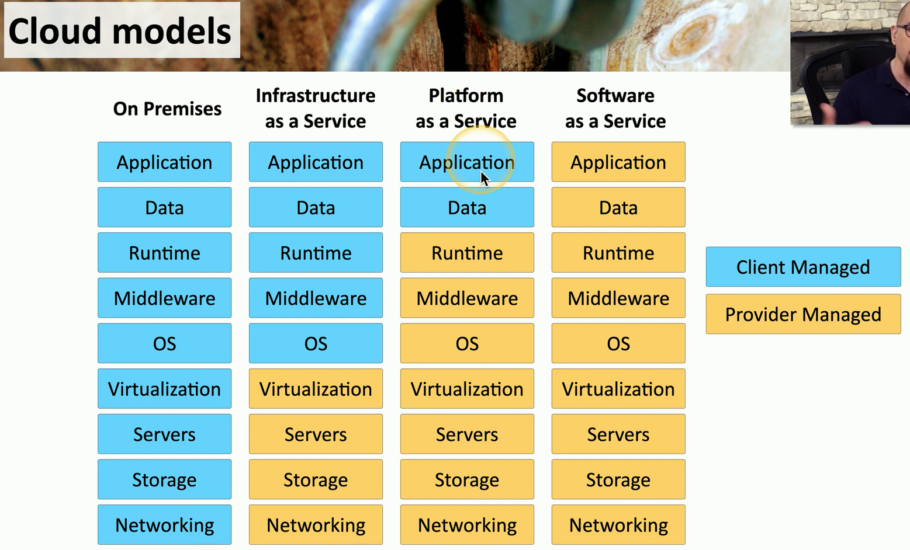

## Infrastructure as a service (IaaS)
- Sometimes called Hardware as a Service (HaaS)
	- Outsource your equipment
- You're still responsible for the management
	- And for the security
- Your data is out there, but more within your control
- Web server providers

## Software as a service (SaaS)
- On-demand software
	- No local installation
	- Why manage your own email distribution? Or Payroll?
- Central management of data and applications
	- Your data is out there
		- Email
		- Payroll
		- Etc...
- A complete application offering
	- No development work required
		- Google Mail

## Platform as a service (Paas)
- No servers
- No Software
- No Maintenance Team
- No HVAC

>Someone else handles the platform, you handle the development

- You don't have direct control of the data, people, or infrastructure
	- Trained security professionals are watching your stuff
		- *Choose Carefully*
- Put the building blocks together
	- Develop your app from what's available on the platform
		- https://www.SalesForce.com

## Anything as a Service (XaaS)
- A broad description of all cloud models
	- Use any combination of the cloud
- Services delivered over the internet
	- Not locally hosted or managed
- Flexible consumption model
	- No large upfront costs or ongoing licensing
- IT becomes more of an operating model
	- And less of a cost-center model
	- Any IT function can be changed into a service

## Cloud model

## Cloud service providers
- Provide cloud services
	- SaaS
	- PaaS
	- LaaS
	- Etc...
- Charge a flat fee or based on use
	- More data, more cost
- You still manage your processes
	- Internal Staff
	- Development Team
	- Operational Support

## Managed service providers
- Managed Service Provider (MSP)
	- Also a cloud service provider
		- Not all cloud service providers are MSPs
- MSP Support
	- Network connectivity management
	- Backups are disaster recover
	- Growth management and planning
- Managed Security Service Provider (MSSP)
	- Firewall management
	- Patch management
	- Security audits
	- Emergency response

## On-premises vs. off-premises
- On-premises (OnPrem)
	- Your applications are on local hardware
	- Your servers are in your data center in your building
- Off-premises (OffPrem) / Hosted
	- Your servers are not in your building
	- They may not even be running on your hardware
	- Usually a specialized computing environment

## Cloud deployment models
- Public
	- Available to everyone over the Internet
- Community
	- Several organizations share the same resources
- Private
	- Your own virtualized local data center
- Hybrid
	- A mix of public and private

