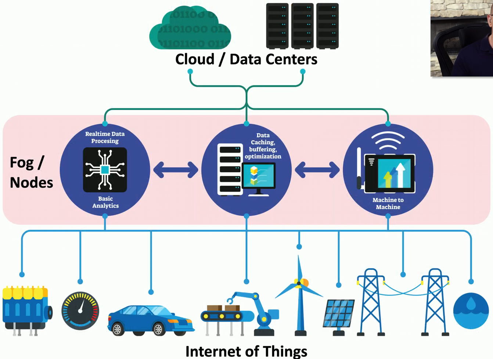

## Cloud computing
- Computing on-demand
	- Instantly available computer power
	- Massive data storage capacity
- Fast implementation
	- IT teams can adjust rapidly to change
	- Smaller startup costs and pay-as-you-go
- Not always the best solution
	- Latency
		- The cloud is far away
	- Limited bandwidth
	- Difficult to protect data
	- Requires Internet
		- Network Connectivity

## Edge computing
- Over 30 billion IoT (Internet of Things) devices on the Internet
	- Devices with very specific functions
		- Alarm Systems
		- Lights
		- Climate Control
		- Washer/Dryer
		- Etc...
	- A huge amount of data
- Edge Computing - "Edge"
	- Process application data on an edge server
	- Close to the user
- Often process data on the device itself
	- No latency, no network requirement
	- Increased speed and performance
	- Process where the data is
		- Instead of processing in the cloud

## Fog computing
- Fog
	- A cloud that's close to your data
	- Cloud + Internet of things
- Fog computing
	- A distributed cloud architecture
	- Extends the cloud
- Distribute the data and processing
	- Immediate data stays local
		- No latency
	- Local decisions made form local data
		- No bandwidth requirements
	- Private data never leaves
		- Minimizes security concerns
	- Long-term analysis can occur in the cloud
		- Internet only when required

