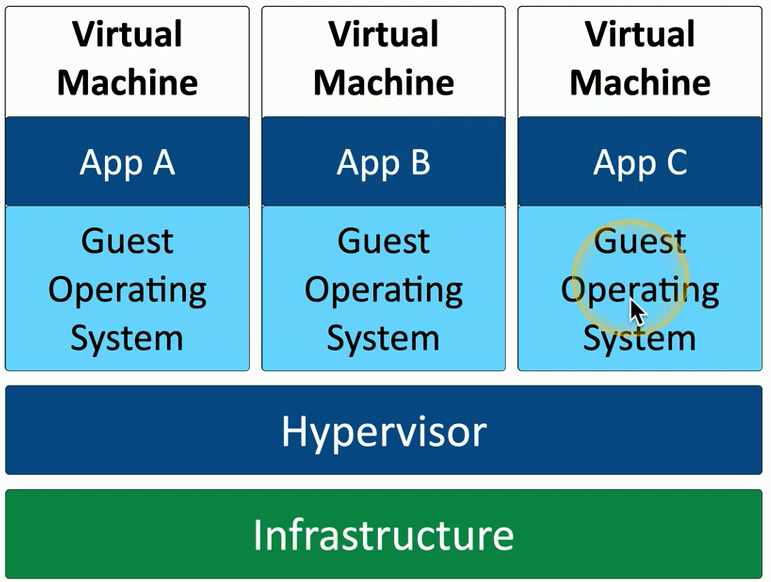
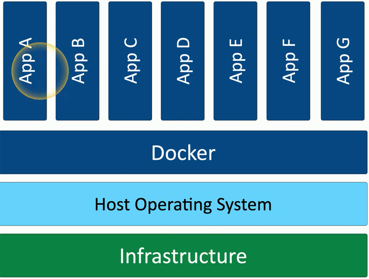
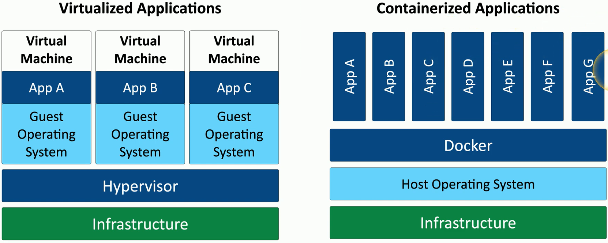
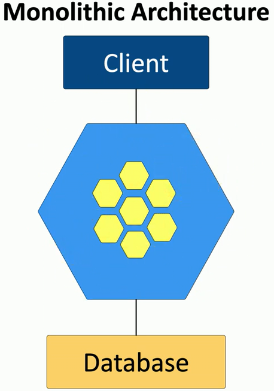
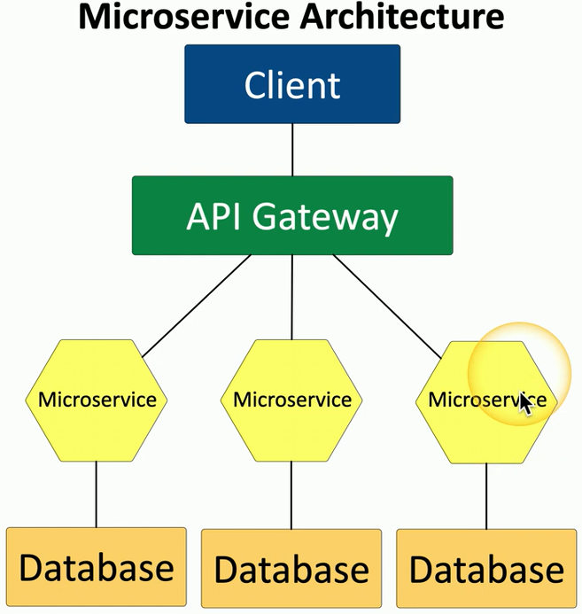

- On-demand computing power
	- Click a button
- Elasticity
	- Scale up or down as needed
- Applications also scale
	- Access from anywhere
- How long does it all happen?
	- Planning and technology

## Thin client
- Basic application usage
	- Applications actually run on a remote server
	- Virtual Desktop Infrastructure (VDI)
		- Desktop as a Service (DaaS)
	- Local device is a keyboard, mouse, and screen
- Minimal operating system on the client
	- No huge memory or CPU needs
- Network connectivity
	- Big network requirement
	- Everything happens across the wire

## Virtualization
- Virtualization
	- Run many different operating systems on the same hardware
- Each applications instance has its own operating system
	- Adds overhead and complexity
	- Virtualization is relatively expensive

## Application containerization
- Container
	- Contains everything you need to run an application
		- ie: Docker
	- Code and dependencies
	- A standardized unit of software
- An isolated process in a sandbox
	- Self-contained
	- Apps can't interact with each other
- Container image
	- A standard for portability
	- Lightweight, uses the host kernel
	- Secure separation between applications

## Virtualized vs. Containerized

## Microservices and APIs
- Monolithic applications
	- One big application that does everything
- Application contains all decision making processes
	- User interface
	- Business logic
	- Data input and output
- Code challenges
	- Large codebase
	- Change control challenges

## Microservices and APIs
- APIs
	- Application Programming Interfaces
- API is the "Glue" for the microservices
	- Work together to act as the application
- Scalable
	- Scale just the microservices you need
- Resilient
	- Outages are contained
- Security and compliance
	- Containment is built-in

## Serverless architecture
- Function as a Service (FaaS)
	- Applications are separated into individual, autonomous functions
	- Remove the operating system from the equation
- Developer still creates the server-side logic
	- Runs in a stateless compute container
- May be event triggered and ephemeral (Temporary)
	- May only run for one event
- Managed by a third-party
	- All OS security concerns are at the third-party

## Transit gateway
- Virtual Private Cloud (VPC)
	- A pool of resources created in a public cloud
- Common to create many VPCs
	- Many different application clouds
- Connect VPCs with a transit gateway
	- And users to VPCs
		- A "Cloud Router"
- Now make it secure
	- VPCs are commonly on different IP subnets
	- Connecting to the cloud is often through a VPN

## Resource policies
- Assigning permissions to cloud resources
	- Not the easiest task
	- Everything is in constant motion
- Specify which resources can be provisioned (Azure)
	- Create a service in a specific region
		- Deny all others
- Specify the resource and what actions are permitted (Amazon)
	- Allow access to an API gateway from an IP address range
- Explicitly list the users who can access the resource (Amazon)
	- Userlist is associated with the resource

## Service integration
- Service integration and Management (SIAM)
- Many different service providers
	- The natural result of multisourcing
- Every provider works differently
	- Different tools and processes
- SIAM is the integration of these divers providers
	- Provide a single business-facing IT organization
- An evolving set of processes and procedures

