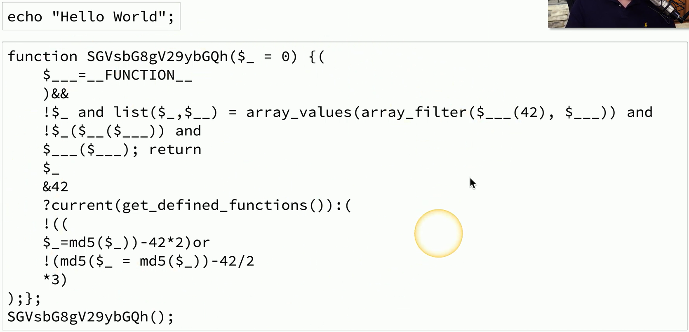
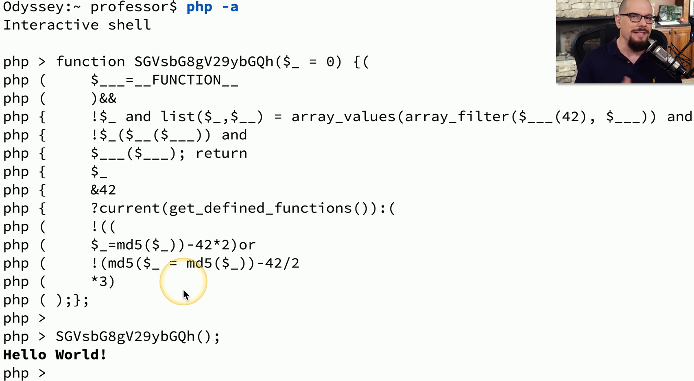

## Secure coding concepts
- A balance between time and quality
	- Programming with security in mind is often secondary
- Testing, testing, testing
	- The Quality Assurance (QA) process
- Vulnerabilities will eventually be found
	- And exploited

## Stored procedures
- SQL databases
	- Client sends detailed requests for data
		- `'SELECT * FROM wp_options WHERE option_id = 1'`
- Client requests can be complex
	- And sometimes modified by the user
		- This would not be good
- Stored procedures limit the client interactions
	- `'CALL get_options'`
		- That's it. No modifications to the query are possible
- To be really secure, use only stored procedures
	- The application doesn't use any SQL queries

## Obfuscation/Camouflage
- Obfuscate
	- Make something normally understandable, very difficult to understand
- Take perfectly readable code and turn it into nonsense
	- The developer keeps the readable code and gives you the chicken scratch
	- Both sets of code perform exactly the same way
- Helps prevent the search for security holes
	- Makes it more difficult to figure out what's happening
	- But not impossible

## Code obfuscation

#### Ran as PHP

## Code reuse/dead code
- Code reuse
	- Use old code to build new applications
		- *Copy and Paste*
- If the old code has security vulnerabilities, reusing the code spreads it to other applications
	- You're making this much more difficult for everyone
- Dead code
	- Calculations are made, code is executed, results are tallie
		- The results aren't used anywhere else in the application
- All code is an opportunity for a security problem
	- Make sure your code is as alive as possible

## Input validation
- What is the expected input?
	- Validate actual vs. expected
- Document all input methods
	- Forms
	- Fields
	- Type
- Check and correct all input (normalization)
	- A zip code should be only `X` characters long with a letter in the `X` column
	- Fix any data with improper unit
- The fuzzers will find what you missed
	- Don't give them an opening

## Validation points
- Server-side validation
	- All checks occur on the server
	- Helps protect against malicious users
		- Attackers may not even be using your interface
- Client-side validation
	- The end-user's app makes the validation decisions
	- Can't filter legitimate input from genuine users
	- May provide additional speed to the user
- Use both
	- But especially server-side validation

## Memory management
- As a developer, you must be mindful of how memory is used
	- Many opportunities to build vulnerable code
- Never trust data input
	- Malicious users can attempt to circumvent your code
- Buffer overflows are a huge security risk
	- Make sure your data matches your buffer sizes
- Some built-in functions are insecure
	- Use best practices when designing your code

## Third-party libraries and SDKs
- Your programming language does everything
	- *Almost*
- Third-party libraries and software development kits
	- Extend the functionality of a programming language
- Security risk
	- Application code written by someone else
		- Might be secure
		- Might not be secure
	- Extensive testing is required
- Balance act
	- Application features vs. unknown code base

## Data exposure
- So much sensitive data
	- Credit Card Numbers
	- Social Security Numbers
	- Medical Information
	- Address Details
	- Email Information
- How is the application handling the data?
	- No encryption when stored
	- No encryption across the network
	- Displaying information on the screen
- All input and output processes are important
	- Check them all for data exposure

## Version control
- Create a file, make a change, make another change, and another change
	- Track those changes
	- Revert back to a previous version
- Commonly used in software development
	- Operating Systems
	- Wiki Software
	- Cloud-based file storage
- Useful for security
	- Compare versions over time
	- Identify modifications to important files

