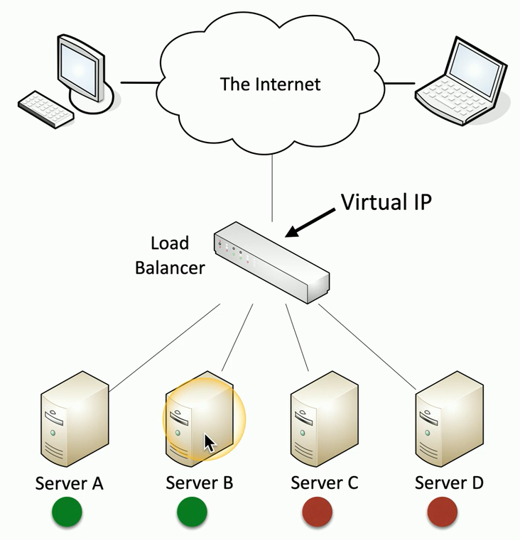
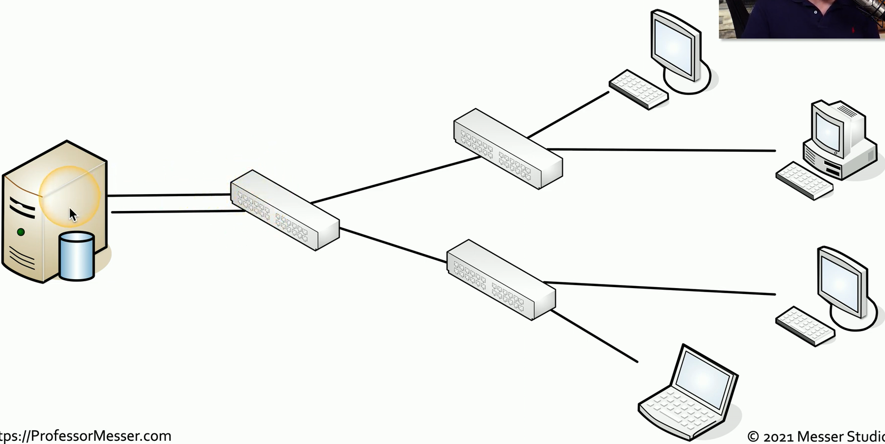
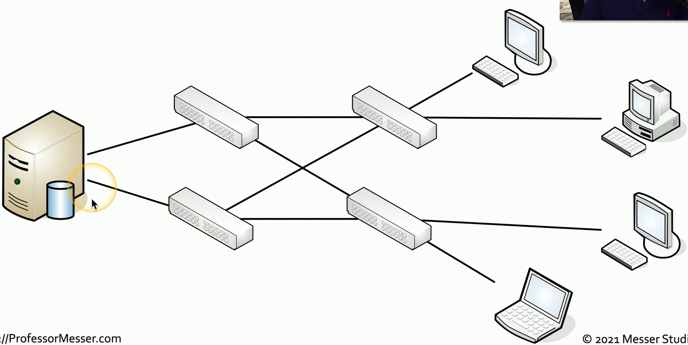

## Load balancing
- Some servers are active
	- Others are on standby
- If an active server fails, the passive server takes its place

## NIC teaming
- Load Balancing / Fail Over (LBFO)
	- Aggregate bandwidth
		- Redundant paths
	- Becomes more important in the virtual world
- Multiple network adapters
	- Looks like a single adapter
	- Integrate with switches
- NICs talk to each other
	- Usually multicast instead of broadcast
	- Fails over when a NIC doesn't respond

## Port aggregation

## Redundancy

