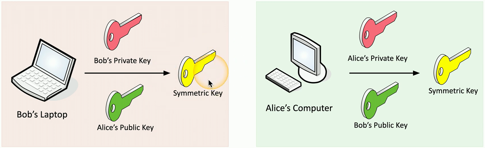

- There's very little that isn't known about the cryptographic process
	- The algorithm is usually a known entity
	- The only thing you don't know is the key
- The key determines the output
	- Encrypted data
	- Hash value
	- Digital signature
- Keep your key private!
	- It's the only thing protecting your data
## Key strength
- Larger keys tend to be more secure
	- Prevent brute-force attacks
	- Attackers can try every possible key combination
- Symmetric encryption
	- 128-bit or larger symmetric keys are common
	- These numbers get larger as time goes on
- Asymmetric encryption
	- Complex calculations of prime numbers
	- Larger keys than symmetric encryption
	- Common to see key lengths of 3,072 bits or larger
## Key exchange
- A logistical challenge
	- How do you transfer an encryption key across an insecure medium
		- Without having an encryption key
- Out-of-band key exchange
	- Don't send the symmetric key over the 'net
		- Telephone
		- Courier
		- In-Person
		- Etc...
- In-band key exchange
	- It's on the network
	- Protect the key with additional encryption
	- Use asymmetric encryption to deliver a symmetric key
## Real-time encryption/decryption
- There's a need for fast security
	- Without compromising the security part
- Share a symmetric session key using asymmetric encryption
	- Client encrypts a random (symmetric) key with a server's public key
	- The server decrypts this shared key and uses it to encrypt data
	- This is the session key
- Implement session keys carefully
	- Need to be changed often (ephemeral keys))
	- Need to be unpredictable
## Symmetric key from asymmetric keys
- Use public and private key cryptography to create a symmetric key
	- Math is powerful

## Traditional web server encryption
- SSL/TLS uses encryption keys to protect web server communication
	- Traditionally, this has been based on the web server's RSA key pair
	- One key that encrypts all symmetric keys
- This server's private key can rebuild everything
	- If you capture all of the traffic
		- You can decrypt all of the data
- One point of failure for all of your web site encryption
## Perfect Forward Secrecy (PFS)
- Change the method of key exchange
	- Don't use the server's private RSA key
- Elliptic curve of Diffie-Hellman ephemeral
	- The session keys aren't kept around
- Can't decrypt with the private server key
	- Every session uses a different private key for the exchange
- PFS requires more computing power
	- Not all servers choose to use PFS
- The browser must support PFS
	- Check your SSL/TLS information for details

