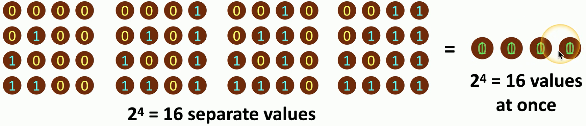
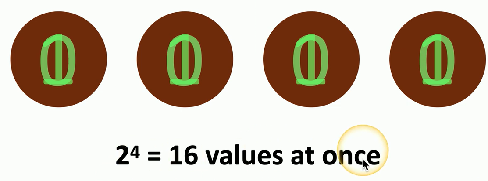
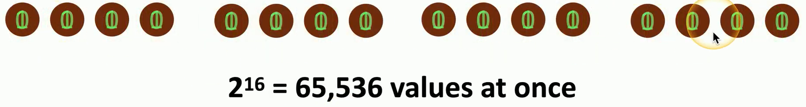
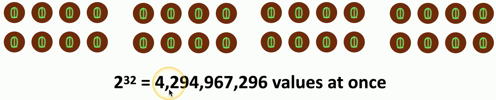

- Computers based on quantum physics
	- This is not an upgrade to your existing computer
	- This is a new computing technology
- Classical mechanics
	- Smallest form of information is a bit
		- Bits are Zeros and Ones
- Quantum mechanics
	- Smallest form of information is a qubit
	- Bits are Zeros, Ones, and any combination in-between, at the same time
		- This is called quantum superposition

## Binary calculations

## Quantum commputing
- Search quickly through large databases
	- Index everything at the same time
- Simulate the quantum world
	- Medical advances
	- Weather prediction
	- Astrophysics
	- Much Much More...
## Post-quantum cryptography
- Breaks our existing encryption mechanisms
	- Quickly factor large prime numbers
- This would cause significant issues
	- None of the existing cryptography could be trusted
	- No financial transactions would be safe
	- No data would be private
- Peter Shor invented `Shor's algorithm` in 1994
	- Given an integer `N`, find it's prime factors
	- Traditional computers would take longer than the lifetime of the universe
	- Shor's algorithm would theoretically be much, much faster
- Time for updated cryptography
	- Not vulnerable to quantum computer based attacks
- NTRU
	- A cryptosystem using lattice theory
	- Relies on the "closest-vector" problem
	- Instead of finding the prime factorizations of large numbers
- We will need to consider our options for future cryptography
	- This is a problem that can be easily seen and addressed
## Quantum communication
- Protect against eavesdropping using quantum cryptography
	- Quantum Key Distribution (QKD)
- Create unbreakable encryption
	- Send a random stream of qubits (the key) across the quantum network channel
- Both sides can verify the key
	- If it's identical, the key was not viewed during transmission
- An attacker eavesdropping on the communication would modify the data stream
	- The attacker would have to violate quantum physics

