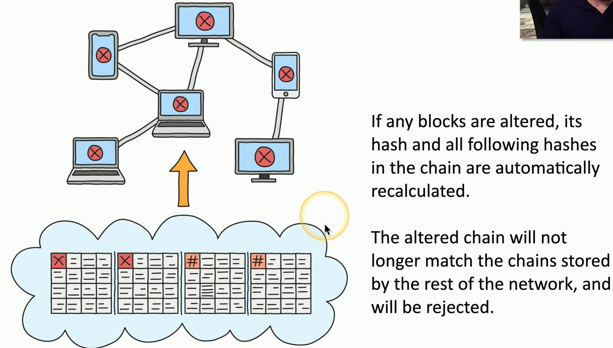

## Blockchain
- A distributed ledger
	- Keep track of transactions
- Everyone on the blockchain network maintains the ledger
	- Records and replicates to anyone and everyone
- Many practical applications
	- Payment processing
	- Digital identification
	- Supply chain monitoring
	- Digital voting
## The blockchain process

