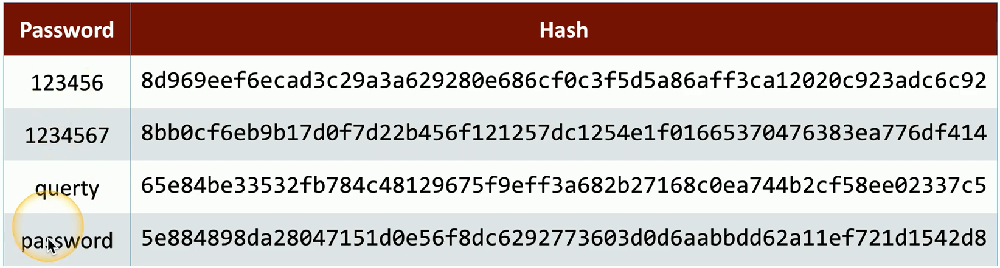
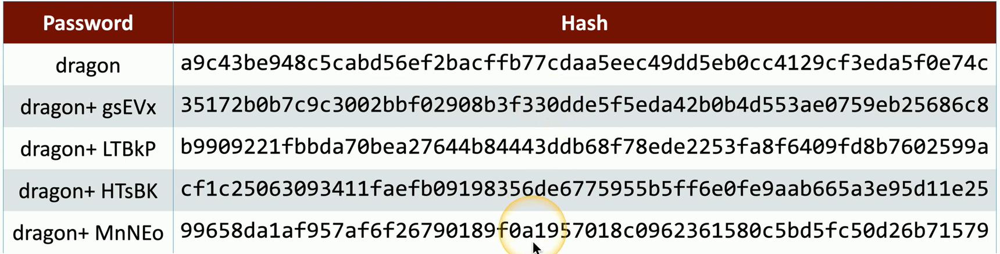

- Protecting stored data
	- And the transmission of that data
- Intellectual property storage
	- Data is valuable
- Compliance issues
	- PCI DSS
	- HIPAA
	- GDPR
	- Etc...
- Keep the business running
	- Security provides continuity
- Breaches are expensive
	- Keep costs low
## Tokenization
- Replace sensitive data with a non-sensitive placeholder
	- SSN 266-12-1112
		- Is now: 691-61-8539
- Common with credit card processing
	- Use a temporary token during payments
	- An attacker capturing the card numbers can't use them later
- This isn't encryption or hashing
	- The original data and token aren't mathematically related
	- No encryption overhead
## Hashing a password
- Hashes represent data as a fixed-length string of text
	- A message digest
		- Or; "Fingerprint"
- Will not have a collision
	- Different inputs will not have the same hash
- One-way trip
	- Impossible to recover the original message from the digest
	- A common way to store passwords
## A hash example
- SHA-256 hash
	- Used in many applications

## Adding some salt
- Salt
	- Random data added to a password when hasing
- Every user gets their own random salt
	- The salt is commonly stored with the password
- Rainbow tables won't work with salted hashes
	- Additional random value added to the original password
- This slows things down for the brute force process
	- It doesn't completely stop the reverse engineering
## Salting the hash
- Each user gets a different random hash
	- The same password creates a different hash

