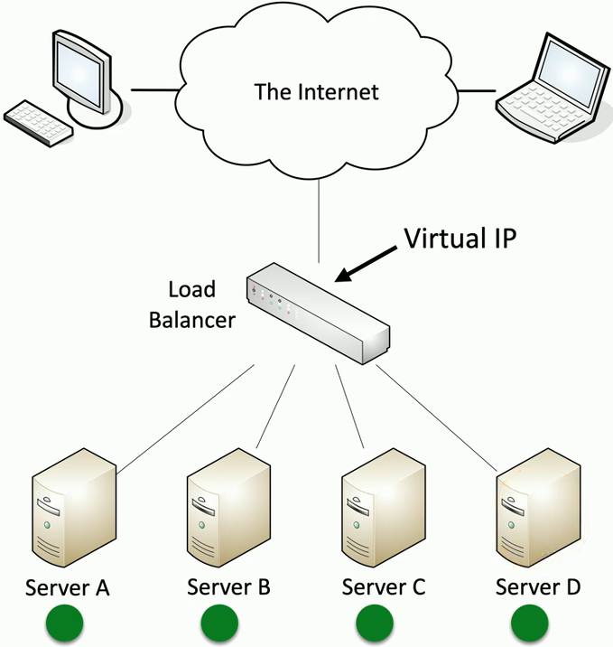
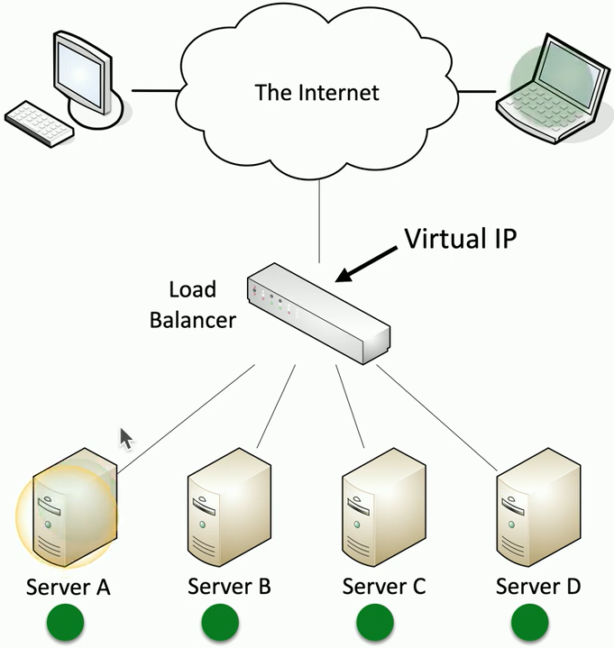
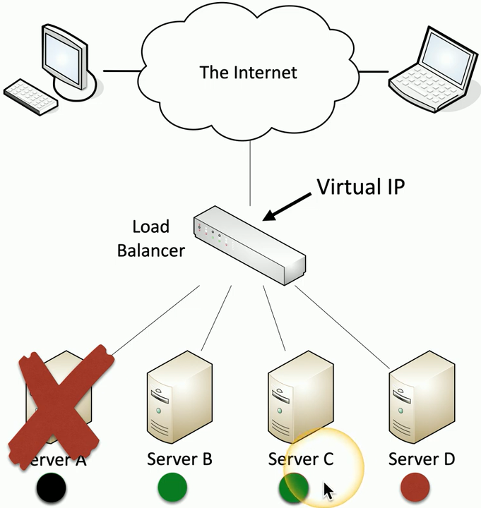

## Balancing the load
- Distribute the load
	- Multiple servers
	- Invisible to the end-user
- Large-scale implementations
	- Web server farms
	- Database farms
- Fault tolerance
	- Server outages have no effect
	- Very fast convergence
## Load balancer
- Configurable load
	- Manage across servers
- TCP offload
	- Protocol overhead
- SSL offload
	- Encryption/Decryption
- Caching
	- Fast response
- Prioritization
	- QoS
- Content switching
	- Application-centric balancing

## Scheduling
- Round-robin
	- Each server is selected in turn
- Weighted round-robin
	- Prioritize the server use
- Dynamic round-robin
	- Monitor the server load and distribute to the server with the lowest use
- Active
	- Active load balancing

## Affinity
	- A kinship or a likeness
- Many applications require communication to the same instance
	- Each user is "stuck" to the same server
	- Tracked through IP address or session IDs
		- Source affinity
		- Sticky session
		- Session persistence

## Active/Passive load balancing
- Some servers are active
	- Others are on standby
- If an active server fails, the passive server takes its place

