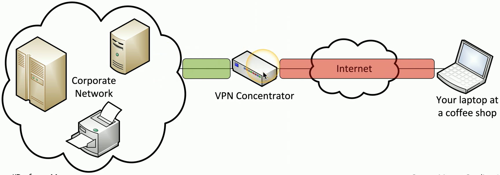
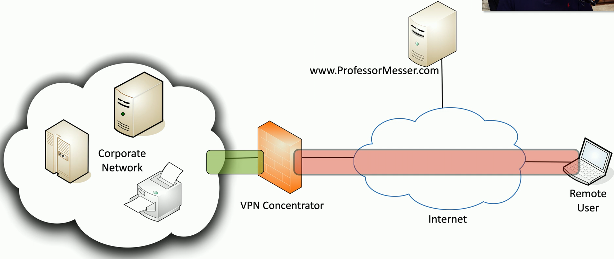
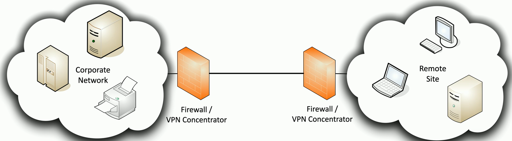
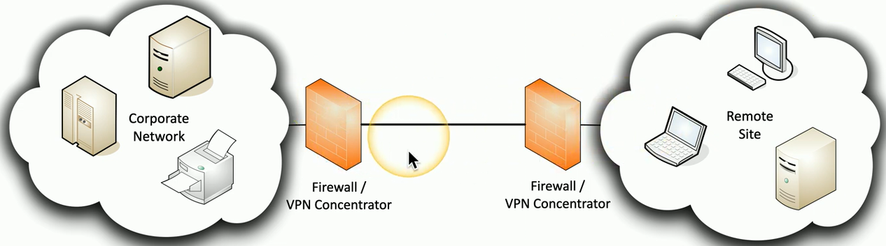

## VPNs
- Virtual Private Networks
	- Encrypted (private) data traversing a public network
- Concentrator
	- Encryption/Decryption
		- Access Device
	- Often integrated into a firewall
- Many deployment options
	- Specialized cryptographic hardware
	- Software-based options available
- Used with client software
	- Sometimes built into the OS
## Remote access VPN

- On-demand access from a remote device
	- Software connects to a VPN concentrator
- Some software can be configured as always-on
## SSL VPN (Secure Sockets Layer VPN)
- Uses common SSL/TLS protocol (tcp/442)
	- (Almost) No firewall issues!
- No big VPN clients
	- Usually remote access communication
- Authenticate users
	- No requirement for digital certificates or shared passwords (like IPSec)
- Can be run from a browser or from a (usually light) VPN client
	- Across many operating systems
## HTML5 VPNs
- Hypertext Markup Language version 5
	- The language commonly used in web browsers
- Includes comprehensive API support
	- Application Programming Interface
	- Web cryptography API
- Create a VPN tunnel without a separate VPN application
	- Nothing to install
- use an HTML5 compliant browser
	- Communicate directly to the VPN concentrator
## Full tunnel

## Split tunnel

## Site-to-site VPN

- Always-on
	- Or almost always
- Firewalls often act as VPN concentrators
	- Probably already have firewalls in place
## L2TP
- Layer 2 Tunneling Protocol
	- Connecting sties over a layer 3 network as if they were connected at layer 2
- Commonly implemented with IPsec
	- L2TP for the tunnel
		- IPsec for the encryption
	- L2TP over IPsec (L2TP/IPsec)

## IPSec (Internet Protocol Security)
- Security for OSI Layer 3
	- Authentication and encryption for every packet
- Confidentiality and intregiry/anti-replay
	- Encryption and packet signing
- Very standardized
	- Common to use multi-vendor implementations
- Two core IPSec protocols
	- Authentication Header (AH)
	- Encapsulation Security Payload (ESP)
## Transport mode and tunnel mode

## Authentication Header (AH)
- Hash of the packet and a shared key
	- SHA-2 is common
	- Adds the AH to the packet header
- This doesn't provide encryption
	- Provides data integrity (hash)
	- Guarantees the data origin (authentication)
	- Prevents replay attacks (sequence numbers)

## Encapsulation Security Payload (ESP)
- Encrypts and authenticates the tunneled data
	- Commonly uses SHA-2 for hash, AES for encryption
	- Ads a header, a trailer, and an integrity check value
- Combine with Authentication Header (AH) for integrity and authentication of the outer header

## IPsec Transport mode and Tunnel mode
- Tunnel mode is the most common
	- Transport mode may not even be an option

