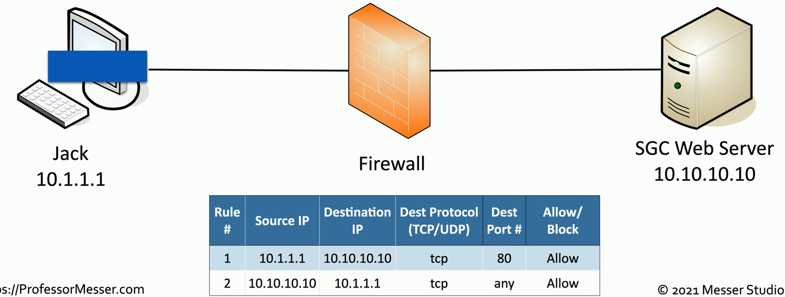

## The Universal Security Control
- Standard issue
	- Home
	- Office
	- In your operating system
- Control the flow of network traffic
	- Everything passes through the firewall
- Corporate control of outbound and inbound data
	- Sensitive materials
- Control of inappropriate content
	- Not safe for work
	- Parental controls
- Protection against evil
	- Anti-virus
	- Anti-malware
## Network-based firewalls
- Filter traffic by port number or application
	- Traditional vs. NGFW firewalls
- Encrypt traffic
	- VPN between sites
- Most firewalls can be layer 3 devices (routers)
	- Often sits on the ingress/egress of the network
	- Network Address Translation (NAT) functionality
	- Authenticate dynamic routing communication
## Stateless firewall
- Does not keep track of traffic flows
	- Each packet is individually exampined
		- Regardless of past history
	- Traffic sent outside of an active session will travers a stateless firewall

## Stateful firewall
- Stateful firewalls remember the "State" of the session
	- Everything within a valid flow is allowed

## UTM / All-in-one security appliance
- Unified Threat Management (UTM)
	- Web security gateway
- URL Filter
	- Content inspection
- Malware inspection
- CSU/DSU
- Router / Switch
- Firewall
- IDS / IPS
- Bandwidth shaper
- VPN endpoint
## Next-generation firewall (NGFW)
- The OSI Application Layer
	- All data in every packet
- Can be called different names
	- Application layer gateway
	- Stateful multilayer inspection
	- Deep packet inspection
- Requires some advanced decodes
	- Every packet must be analyzed and categorized before a security decision is determined
## NGFWs
- Network-based Firewalls
	- Control traffic flows based on the application
		- Microsoft SQL Server
		- Twitter
		- YouTube
- Intrusion Prevention Systems
	- Identify the application
	- Apply application-specific vulnerability signatures to the traffic
- Content filtering
	- URL filters
	- Control website traffic by category
## Web application firewall (WAF)
- Not like a "normal" firewall
	- Applies rules to HTTP/HTTPS conversations
- Allow or deny based on expected input
	- Unexpected input is a common method of exploiting an application
- SQL Injection
	- Add your own commands to an application's SQL query
- A major focus of Payment Card Industry Data Security Standard (PCI DSS)
## Firewall rules
- Access control lists (ACLs)
	- Allow or disallow traffic based on tuples
	- Groupings of categories
		- Source IP
		- Destination IP
		- Port Number
		- Time of Day
		- Application
		- Etc...
- A logical path
	- Usually top-to-bottom
- Can be very general or very specific
	- Specific rules are usually at the top
- Implicit deny
	- Most firewalls include a deny at the bottom
		- Even if you didn't put one
## Web server firewall ruleset

## Firewall characteristics
- Open-Source vs. Proprietary
	- Open-source provides traditional firewall functionality
	- Proprietary features include application control and high-speed hardware
- Hardware vs. Software
	- Purpose-built hardware provides efficient and flexible connectivity options
	- Software-based firewalls can be installed almost anywhere
- Appliance vs. host-based vs. virtual
	- Appliances provide the fasted throughput
	- Host-based firewalls are application-aware and can view non-encrypted data
	- Virtual firewalls provide valuable East/West network security

