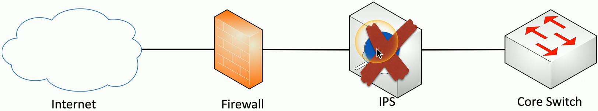

## NIDS and NIPS
- Intrusion Detection System
- Intrusion Prevention System
	- Watch network traffic
- Intrusions
	- Exploits against operating systems, applications, etc...
		- Buffer Overflows
		- Cross-site Scripting
		- Other Vulnerabilities
- Detection vs. Prevention
	- Detection
		- Alarm or Alert
	- Prevention
		- Stop it before it gets into the network
## Passive monitoring
- Examine a copy of the traffic
	- Port mirror (SPAN)
	- Network Tap
- No way to block (Prevent) traffic

## Out-of-band response
- When malicious traffic is identified
	- IPS sends TCP RST (Reset) Frames
		- After-the-fact
		- Limited UDP response available

## Inline monitoring
- IDS/IPS sits physically inline
	- All traffic passes through the IDS/IPS

## In-band response
- Malicious traffic is immediately identified
	- Dropped at the IPS-
	- Does not proceed through the network

## Identification technologies
- Signature-based
	- Look for a perfect match

- Anomaly-based
	- Build a baseline of what's `"Normal"`
- Behavior-based
	- Observe and report
- Heuristics
	- Use artificial intelligence to identify

