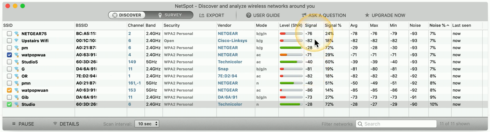

## Site surveys
- Determine existing wireless landscape
	- Sample the existing wireless spectrum
- Identify existing access points
	- You may not control all of them
- Work around existing frequencies
	- Layout and plan for intererence
- Plan for ongoing site surveys
	- Things will certainly change
- Heat maps
	- Identify wireless signal strengths
## Wireless survey tools
- Signal coverage
- Potential interference
- Built-in tools
- 3rd-party tools
- Spectrum analyzer

## Wireless packet analysis
- Wireless networks are incredibly easy to monitor
	- Everyone "hears" everything
- You have to be quiet
	- You can't hear the network if you're busy transmitting
- Some network drivers won't capture wireless information
	- You'll need specialized adapters/chipsets and drivers
- View wireless-specific information
	- Signal-to-noise ratio
	- Channel information
	- Etc...
- Try it yourself:
	- http://www.wireshark.org
## Channel selection and overlaps
- Overlapping channels
	- Frequency conflicts
		- Use non-overlapping channels
	- Automatic or manual configurations

## Overlapping channels

## Access point placement
- Minimal overlap
	- Maximize coverage
	- Minimize the number of access points
- Avoid interference
	- Electronic devices (microwaves)
	- Building materials
	- Third-party wireless networks
- Signal control
	- Place APs where the users are
	- Avoid excessive signal distance
## 2.4 GHz antenna placement

## Wireless infrastructure security
- Wireless controllers
	- Centralized management of wireless access points
	- Manage system configuration and performance
- Securing wireless controllers
	- Control access to management console
	- Use strong encryption with HTTPS
	- Automatic logout after no activity
- Securing access points
	- Use strong passwords
	- Update to the latest firmware

