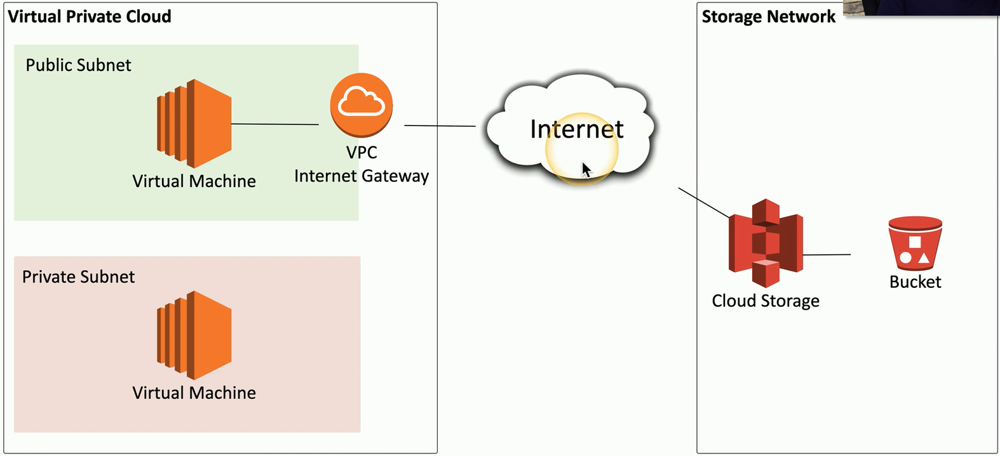

## Compute cloud instances
- The IaaS component for the cloud computing environment
	- Amazon Elastic Compute Cloud (EC2)
	- Google Compute Engine (GCE)
	- Microsoft Azure Virtual Machines
- Manage computing resources
	- Launce a VM or container
	- Allocate additional resources
	- Disable/remove a VM or container
## Security groups
- A firewall for compute instances
	- Control inbound and outbound traffic flows
- Layer 4 port number
	- TCP or UDP port
- Layer 3 address
	- Individual addresses
	- CIDR block notation
	- IPv4 or IPv6
## Dynamic resource allocation
- Provision resources when they are needed
	- Based on demand
	- Provisioned automatically
- Scaled up and down
	- Allocate compute resources where and when they are needed
	- Rapid elasticity
	- Pay for only what's used
- Ongoing monitoring
	- If CPU utilization hits a particular threshold, provision a new application instance
## Instance awareness
- Granular security controls
	- Identify and manage very specific data flows
	- Each instance of data flow is different
- Define and set policies
	- Allow uploads to the corporate box.com file share
		- Corporate file shares can contain PII
		- Any department can upload to the corporate file share
	- Deny certain uploads to a personal box.com file share
		- Allow graphics files
		- Deny any spreadsheet
		- Deny files containing credit card numbers
		- Quarantine the file and send an alert
## Virtual private cloud endpoints
- VPC gateway endpoints
	- Allow private cloud subnets to communicate to other cloud services
- Keep private resources private
	- Internet connectivity not required
- Add an endpoint to connect VPC resources

## Container security
- Containers have similar security concerns as any other application deployment method
	- Bugs
	- Insufficient security controls
	- Misconfigurations
- Use container-specific operating systems
	- A minimalist OS designed for containers
- Group container types on the same host
	- The same;
		- Purpose
		- Sensitivity
		- Threat posture
	- Limit the scope of an intrusion

