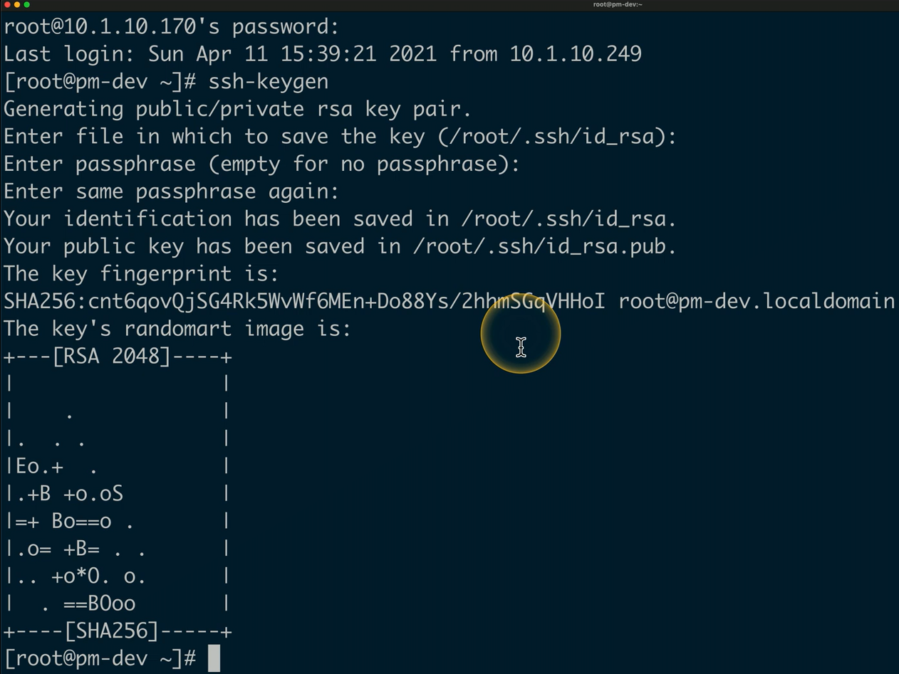
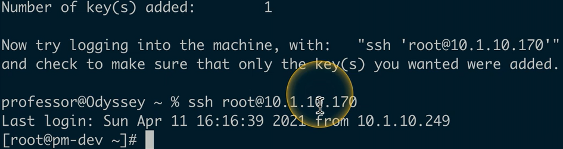

## Identity provider (IdP)
- Who are you?
	- A service needs to vouch for you
	- Authentication as a Service
- A list of entities
	- Users and devices
- Commonly used by SSO applications or an authentication process
	- Cloud-based services need to know who you are
- Uses standard authentication methods
	- SAML
	- OAuth
	- OpenID Connect
	- Etc...
## Attributes
- An identifier or property of an entity
	- Provides identification
- Personal attributes
	- Name
	- Email address
	- Phone number
	- Employee ID
- Other attributes
	- Department name
	- Job title
	- Mail stop
- One or more attributes can be used for identification
	- Combine them for more detail
## Certificates
- Digital certificate
	- Assigned to a person or device
- Bind the identity of the certificate owner to a public and private key
	- Encrypt data
	- Create digital signatures
- Requires an existing public-key infrastructure (PKI)
	- The Certificate Authority (CA) is the trusted entity
	- The CA digitally signs the certificates
## Tokens and cards
- Smart card
	- Integrates with devices
	- May require a PIN
- USB token
	- Certificate is on the USB device
## SSH Keys
- Secure Shell (SSH)
	- Secure terminal communication
- Use a key instead of username and password
	- Public/Private keys
	- Critical for automation
- Key management is critical
	- Centralize
	- Control
	- Audit Key Use
- SSH Key managers
	- Open Source
	- Commercial
## SSH key-based authentication
- Create a public/private key pair
	- `ssh-keygen`
- Copy the public key to the SSH Server
	- `ssh-copy-id user@host`
- Try it out
	- `ssh user@host`
	- No password prompt!

