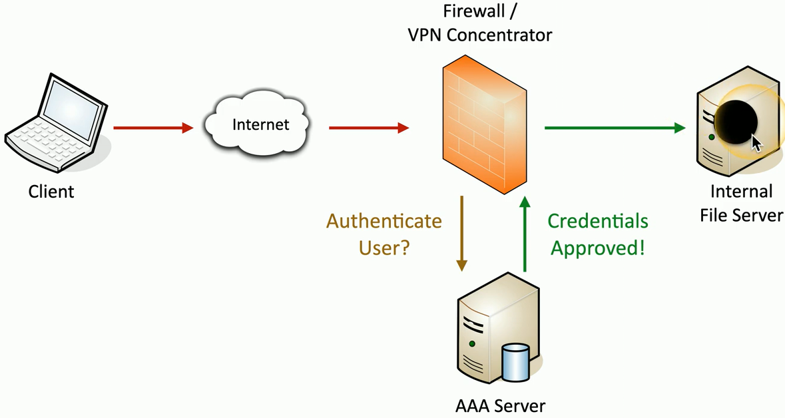

## Gaining access

## PAP (Password Authentication Protocol)
- A basic authentication method
	- Used in legacy operating systems
	- Rate to see singularly used
- PAP is in the clear
	- Weak authentication scheme
	- Non-encrypted password exchange
	- We didn't require encryption on analog dialup lines
	- The application would need to provide any encryption
## PAP authentication

## CHAP
- Challenge-Handshake Authentication Protocol
	- Encrypted challenge sent over the network
- Three-way handshake
	- After link is established
		- Server sends a challenge message
	- Client responds with a password hash calculated from the challenge and the password
		- Server compares received hash with stored hash
- Challenge-Response continues
	- Occurs periodically during the connection
	- User never knows it happens
## CHAP authentication

## MS-CHAP
- Microsoft's implementation of CHAP
	- Used commonly on Microsoft's Point-to-Point Tunneling Protocol (PPTP)
		- MS-CHAP v2 is the more recent version
- Security issues related to the use of DES
	- Relatively easy to brute force the 2`^56` possible keys to decrypt the NTLM hash
	- Don't use MS-CHAP!
		- Consider instead;
			- L2TP
			- IPsec
			- 802.1X
			- Etc...

