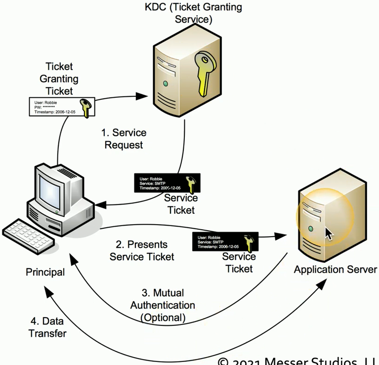

## RADIUS (Remote Authentication Dial-In User Service)
- One of the more common AAA protocols
	- Supported on a wide variety of platforms and devices
	- Not just for dial-in
- Centralize authentication for users
		- Routers
		- Switches
		- Firewalls
	- Server Authentication
	- Remote VPN access
	- 802.1X Network Access
- RADIUS services available on almost any server operating system
## TACACS
- Terminal Access Controller Access-Control System
	- Remote Authentication Protocol
	- Created to control access to dial-up lines to ARPANET
- XTACS (Extended TACACS)
	- A Cisco-created (proprietary) version of TACACS
	- Additional support for accounting and auditing
- TACACS+
	- The latest version of TACACS
		- Not backwards compatible
	- More authentication requests and response codes
	- Released as an open standard in 1993
## Kerberos
- Network authentication protocol
	- Authenticate cone
		- Trusted by the system
	- No need to re-authenticate to everything
	- Mutual authentication
		- The client and the server
			- Protect against on-path or replay attacks
- Standard since the 1980s
	- Developed by the Massachusetts Institute of Technology (MIT)
- Microsoft started using Kerberos in Windows 2000
	- Based on Kerberos 5.0 open standard
	- Compatibly with other operating systems and devices
## SSO with Kerberos
- Authenticate on time
	- Lots of backend ticketing
	- Cryptographic tickets

- No constant username and password input!
	- Save time
- Only works with Kerberos
	- Not everything is Kerberos-friendly
- There are many other SSO methods
	- SAML
	- Cloud-Based
	- Smart-Cards
	- Etc...
## RADIUS, TACACS+, or Kerberos?
- Three different ways to communicate to an authentication server
	- More than a simple login process
- Often determined by what is at hand
	- VPN concentrator can talk to a RADIUS server
	- We have a RADIUS server
- TACACS+
	- Probably a Cisco device
- Kerberos
	- Probably a Microsoft network
## IEEE 802.1X
- IEEE 802.1X
	- Port-based Network Access Control (NAC)
	- You don't get access to the network until you authenticate
- EAP integrates with 802.1X
	- Extensive Authentication Protocol
	- 802.1X prevents access to the network until the authentication succeeds
- Used in conjunction with an access database
	- RADIUS
	- LDAP
	- TACACS+

