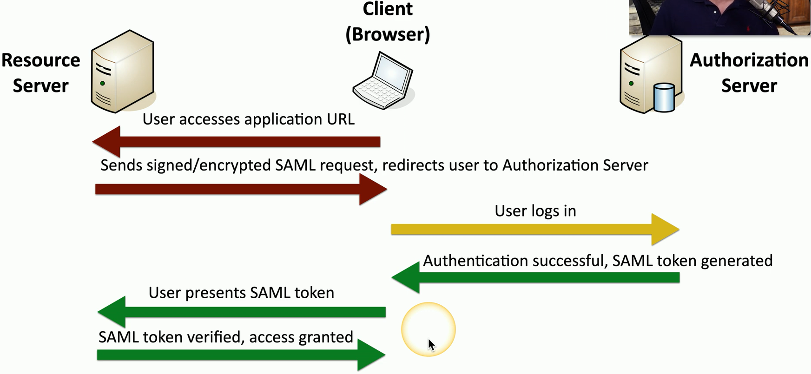

## Federation
- Provide network access to others
	- Not just employees;
		- Partners
		- Suppliers
		- Customers
		- Etc...
	- Provide SSO and more
- Third-parties can establish a federated network
	- Authenticate and authorize between the two organizations
	- Login with your Facebook credentials
- The third-parties must establish a trust relationship
	- And the degree of the trust
## Security Assertion Markup Language (SAML)
- Open standard for authentication and authorization
	- You can authenticate through a third-party to gain access
	- One standard does it all
		- Sort of
- Not originally designed for mobile apps
	- This has been SAML's largest roadblock
## The SAML authentication flow

## OAuth
- Authorization framework
	- Determines what resources a user will be able to access
- Created by;
	- Twitter
	- Google
	- Etc...
		- Significant industry support
- Not an authentication protocol
	- OpenID Connect handles the single sign-on authentication
	- OAuth provides authorization between applications
- Relatively popular
	- Used by;
		- Twitter
		- Google
		- Facebook
		- LinkedIn
		- Etc...

