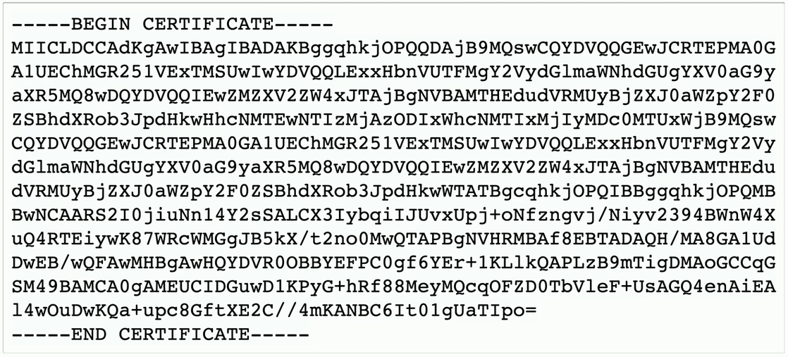

## Certificate file formats
- X.509 Digital certificates
	- The structure of the certification is standardized
	- The format of the actual certificate file can take many different forms
- There are many certificate file formats
	- You can convert between many of the formats
	- Use OpenSSL or a similar application to view the certificate contents

## DER (Distinguished Encoding Rules)
- Format designed to transfer syntax for data structures
	- A very specific encoding format
	- Perfect for an X.509 certificate
- Binary format
	- Not human-readable
- A common format
	- Used across many platforms
	- Often used with Java certificates
## PEM (Privacy-Enhanced Mail)
- A very common format
	- Base64 encoded DER certificate
	- Generally the format provided by CAs
	- Supported on many different platforms
- ASCII format
	- Letters and numbers
	- Easy to email
	- Readable

## PKCS #12
- Public Key Cryptography Standards #12
- Personal Information Exchange Syntax Standard
	- Developed by RSA Security, now an RFC standard
- Container format for many certificates
	- Store many X.509 certificates in a single `.p12` or `.pfx` file
	- Often used to transfer a private and public key pair
	- The container can be password protected
- Extended from Microsoft's `.pfx` format
	- Personal Information Exchange (PFX)
	- The two standards are very similar
	- Often referenced interchangeably
## CER (Certificate)
- Primarily a Windows X.509 file extension
	- Can be encoded as binary DER format or the ASCII PEM format
- Usually contains a public key
	- Private keys would be transferred in the `.pfx` file format
- Common format for windows certificates
	- Look for the `.cer` extension
## PKCS #7
- Public Key Cryptography Standards #7
- Cryptographic message Syntax Standard
	- Associated with the `.p7b` file
- Stored in ASCII format
	- Human-readable
- Contains certificates and chain certificates
	- Private keys are not included in a `.p7b` file

