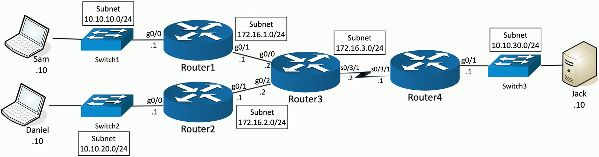
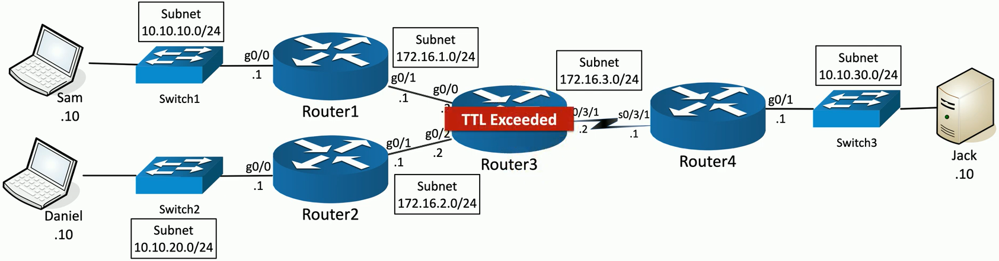

## Traceroute
- Determine the route a packet takes to a destination
	- Map the entire path
		- `tracert` (Windows)
		- `traceroute` (Unix/Linux/MacOS)
- Takes advantage of ICMP Time to Live Exceeded error message
	- The time in TTL refers to hops, not seconds or minutes
	- `TTL=1` is the first router
	- `TTL=2` is the second router
	- Etc...
- Not all devices will reply with ICMP Time Exceeded messages
	- Some firewalls filter ICMP
	- ICMP is low-priority for many devices
## Flavors of traceroute
- Not all traceroutes are the same
	- Minor differences in the transmitted payload
- Windows commonly sends ICMP echo requests
	- Receives ICMP time exceeded messages
	- And an ICMP echo reply from the final/destination device
	- Unfortunately, outgoing ICMP is commonly filtered
- Some operating systems allow you to specify the protocol used
	- Linux
	- Unix
	- MacOS
	- Etc...
- IOS devices send UDP datagrams over port 33434
	- The port number can be changed with extended options
## The mechanics of traceroute
- Tracing route to 10.10.30.10 over a maximum of 30 hops:



- 2
	- 1ms
		- 172.16.1.2
## Traceroute in action (Quad9)
```
traceroute 9.9.9.9
```

## nslookup and dig
- Lookup information from DNS servers
	- Canonical names
	- IP Addresses
	- Cache timers
	- Etc...
- nslookup
	- Both windows and POSIX-based
	- Lookup names and IP addresses
	- Deprecated (use dig instead)
- dig (Domain Information Groper)
	- More advanced domain information
	- Probably your first choice
	- Install in Windows
		- https://professormesser.link/digwin
## nslookup in action (Professormesser.com)

## dig in action (Professormesser.com)

## ipconfig and ifconfig
- Most of your troubleshooting starts with IP address
	- Ping your local router/gateway
- Determine TCP/IP and network adapter information
	- And some additional IP details
- `ipconfig`
	- Windows TCP/IP configuration
- `ifconfig`
	- Linux interface configuration
## ipconfig example

## ipconfig /all example

## ping
- Test reachability
	- Determine round-trip time
	- Uses Internet Control Message Protocol (ICMP)
- One of your primary troubleshooting tools
	- Can you ping the host?
- Written by Mike Muuss in 1983
	- The sound made by sonar
	- Not an acronym for Packet INternet Groper
		- A backronym
## pathping
- Combine ping and traceroute
	- Included with Windows NT and later
- First phase runs a traceroute
	- Build a map
- Second phase
	- Measure round trip time and packet loss at each hop


## netstat
- Network statistics
	- Many different operating systems
- `netstat -a`
	- Show all active connections
- `netstat -b`
	- Show binaries (Windows)
- `netstat -n`
	- Do not resolve names
```
netstat -a -b -n
```

## Address Resolution Protocol
- Determine a MAC address based on an IP address
	- You need the hardware address to communicate
- `arp -a`
	- View local ARP table

```
arp -a
```


## route
- View the device's routing table
	- Find out which way the packets will go
- Windows
	- `route print`
- Linux and macOS
	- `netstat -r`

```
route print
```


