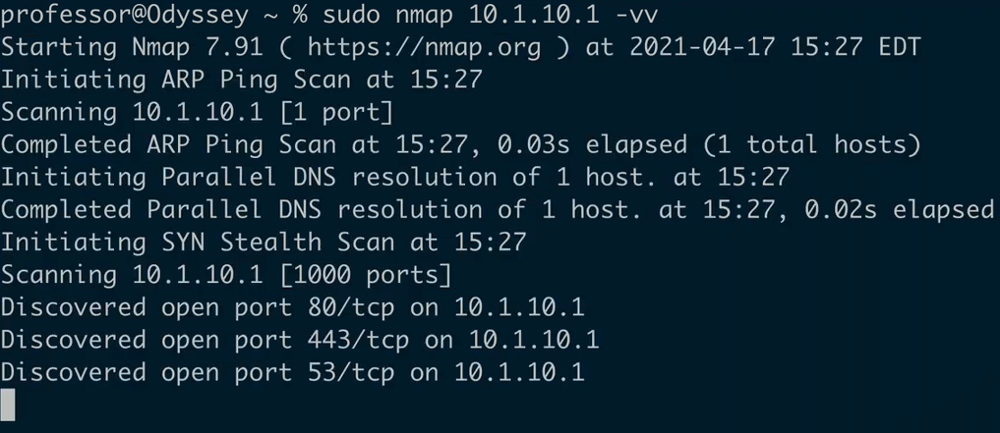
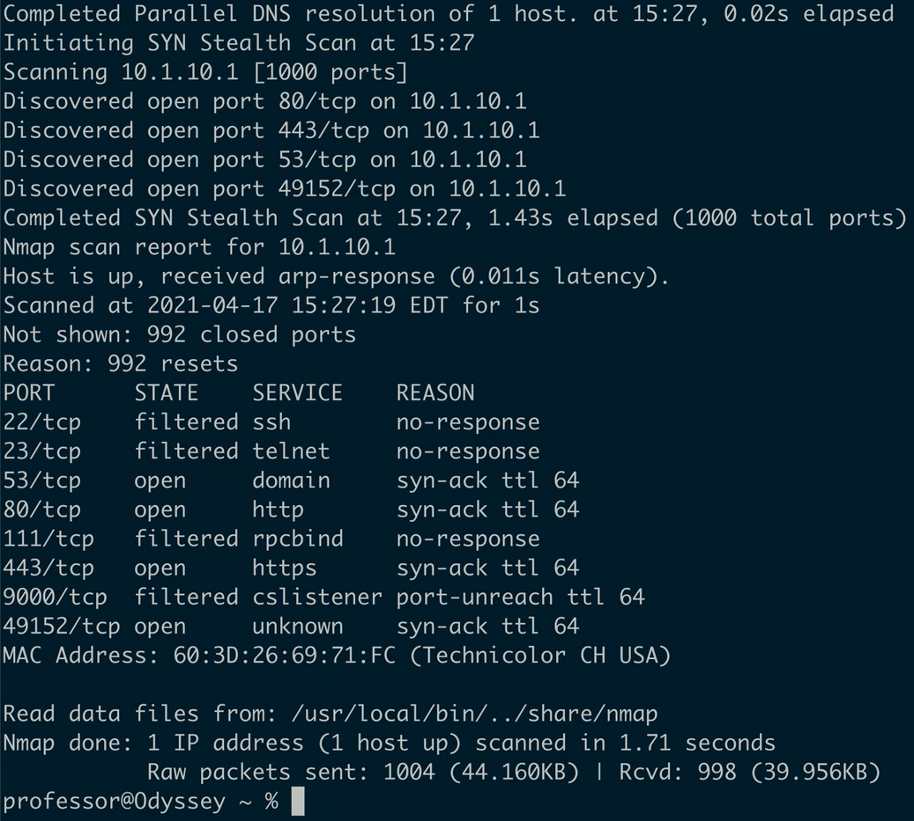

## curl
- Client URL
	- Retrieve data using a URL
	- Uniform Resource Locator
		- Web pages
		- FTP
		- Emails
		- Databases
		- Etc...
- Grab the raw data
	- Search
	- Parse
	- Automate
```
curl www.professmermesser.com
```

```
curl https://www.professormessor.com
```

## IP scanners
- Search a network for IP addresses
	- Locate active devices
	- Avoid doing work on an IP address that isn't there
- Many different techniques
	- ARP
		- If on the local subnet
	- ICMP requests
		- Ping
	- TCP ACK
	- ICMP timestamp requests
- A response means more recon can be done
	- Keep gathering information
		- Nmap
		- hping
		- Etc...
## hping
- TCP/IP packet assembler/analyzer
	- A ping that can send almost anything
- Ping a device
	- ICMP, TCP, UDP
		- `hping3 --destport 80 10.1.10.1`
- Send crafted frames
	- Modify all;
		- IP
		- TCP
		- UDP
		- ICMP values
		- Etc...
- A powerful tool
	- It's easy to accidentally flood and DoS
		- BE CAREFUL!
## hping example
```
sudo hping3 10.1.10.1
```

```
sudo hping3 --scan 80-443 -S 10.1.10.1 -V 
```

## Nmap
- Network mapper
	- Find and learn about network devices
- Port scan
	- Find devices and identify open ports
- Operating system scan
	- Discover the OS without logging in to a device
- Service scan
	- What service is available on a device?
		- Name
		- Version
		- Details
- Additional scripts
	- Nmap Scripting Engine (NSE)
		- Extend Capabilities
		- Vulnerability scans
## nmap example
```
sudo nmap 10.1.10.1 -vv
```


## theHarvester
- Gather OSINT
	- Open-Source Intelligence
- Scrape information from Google or Bing
	- Find associated IP addresses
- List of people from LinkedIn
	- Name and titles
- DNS brute force
	- Find those unknown hosts
		- VPN
		- Chat
		- Mail
		- Partner
		- Etc...

## theHarvester example
```
sudo theHarvester -d example.com -l 100 -b bing
```

## sn1per
- Combine many recon tools into a single framework
	- dnsenum
	- metasploit
	- nmap
	- theHarvester
	- Etc...
- Both non-intrusive and very intrusive scanning options
	- You choose the volume
- Another tool that can cause problems
	- Brute force
	- Server scanning
	- etc...
		- Make sure you know what you're doing
## sn1per example
```
sudo sniper -t example.com -m web
```

## scanless
- Run port scans from a different host
	- Port scan proxy
- Many different services
	- Choose the option for scan origination
	- Your IP is hidden as the scan source

## scanless example
```
scanless -t scanme.nmap.org -s spiderip
```

## dnsenum
- Enumerate DNS information
	- Find host names
- View host information from DNS servers
	- Many services and hosts are listed in DNS
- Find host names in Google
	- More hosts can probably be found in the index
## dnsenum example
```
dnsenum -v example.com
```

## Nessus
- Industry leader in vulnerability scanning
	- Extensive support
	- Free and commercial options
- Identify known vulnerabilities
	- Find systems before they can be exploited
- Extensive reporting
	- A checklist of issues
	- Filter out the false positives


## Cuckoo
- A sandbox for malware
	- Test a file in a safe environment
- A virtualized environment
	- Windows
	- Linux
	- macOS
	- Android
- Track and trace
		- API calls
		- Network traffic
		- Memory analysis
	- Traffic captures
	- Screenshots

