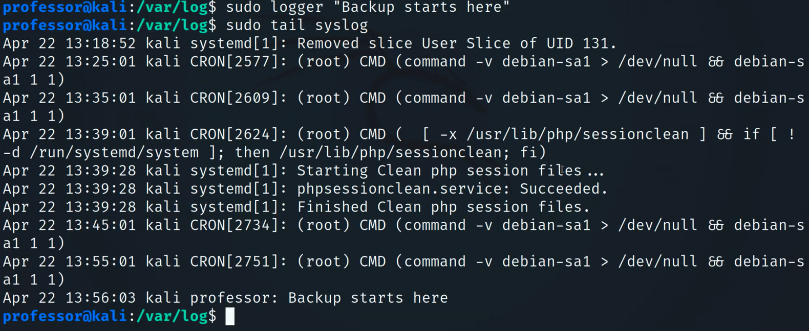

## cat
- Concatenate
	- Link together in a series
- Copy a file/files to the screen
	- `cat file1.txt file2.txt`
- Copy a file/files to another file
	- `cate file1.txt file2.txt > both.txt`
## head
- View the first part of a file
	- The head, or beginning, of the file
	- `head [OPTION]  ...  [FILE]  ...`
- Use `-n` to specify the number of lines
	- `head -n 5 syslog`

## tail
- View the last part of a file
	- The tail, or end, of the file
	- `tail [OPTION]  ...  [FILE]  ...`
- Use `-n` to specify the number of lines
	- `tail -n 5 syslog`

## grep
- Find text in  a file
	- Search through many files at a time
- `grep PATTERN [FILE]`
>	`grep failed auth.log`

## chmod
- Change mod of a file system object
		- `r`=Read
		- `w`=Write
		- `x`=Execute
	- Can also use octal notation
		- The file owner `(u)`
		- The group `(g)`
		- Others `(o)`
		- All `(a)`

- `chmod mode FILE`
>	`chmod 744 script.sh`

- `chmod 744 first.txt`
	- User;
		- Read
		- Write
		- Execute
	- Group;
		- Read only
	- Other;
		- Ready only
- `chmod a-w first.txt`
	- All users;
		- No writing to first.txt
- `chmod u+x script.sh`
	- The owner of script.sh can execute the file
## logger
- Add entries to the system log
	- syslog
- Adding to the local syslog file
	- `logger "This information is added to syslog"`
- Useful for including information in a local or remote syslog file
	- Include as part of an automation script
	- Log an important event
```
sudo tail syslog
```

```
sudo logger "Backup starts here"
```
```
sudo tail syslog
```


