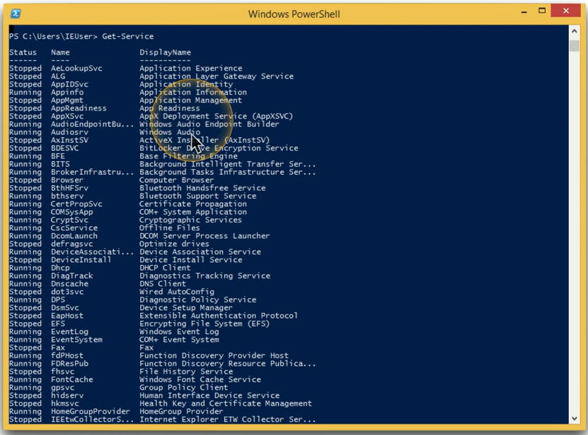
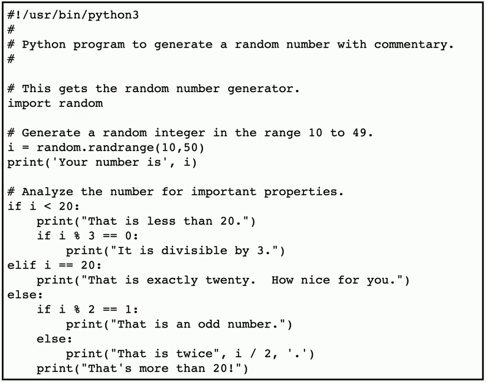

## SSH (Secure Shell)
- Encrypted console communication
	- tcp/22
- Look and acts the same as Telnet

## Windows PowerShell
- Command line for system administrators
	- `.ps1` file extension
	- Included with Windows 8/8.1/10/11
- Extend command-line functions
	- Use cmdlets (command-lets)
	- PowerShell scripts and functions
	- Standalone executables
- Automate and integrate
	- System administration
	- Active Domain administration

## Python
- General-purpose scripting language
	- `.py` file extension
- Popular in many technologies
	- Broad appeal and support

## OpenSSL
- A toolkit and crypto library for SSL/TLS
	- Built certificates
	- Manage SSL/TLS communication
- Create X.509 certificates
	- Manage certificate signing requests (CSRs)
		- And Certificate revocation lists (CRLs)
- Message digests
	- Support for many hashing protocols
- Encryption and Decryption
	- SSL/TLS for services

