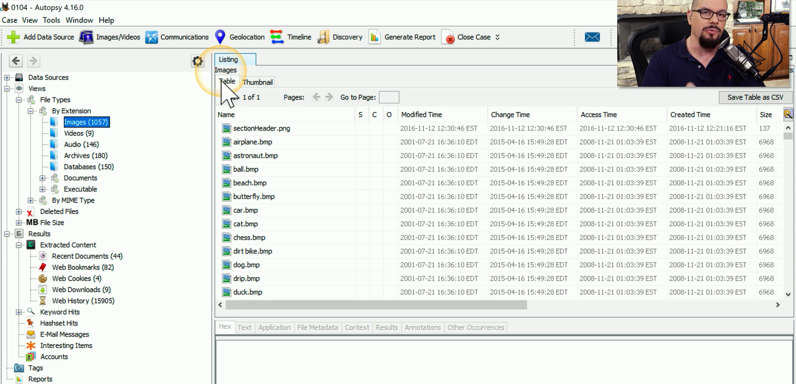

## dd
- A reference to the DD command in the IBM mainfram JCL (Job Control Language)
	- Data Definition (ASCII to EBCDIC Converter)
- Create a bit-by-bit copy of a drive
	- Used by many forensics tools
- Create a disk image
>	`dd if=/dev/sda of=/tmp/sda-image.img`
- Restore from an image
>	`dd if=/tmp/sda-image.img of=/dev/sda`
## memdump
- Copy information in system memory to the standard output stream
	- Everything that happens is in memory
	- Many third-party tools can read a memory dump
- Copy to another host across the network
	- Netcat
	- sTunnel
	- OpenSSL
	- Etc...
## WinHex
- A universal hexadecimal editor
	- Windows OS
- Edit disks, files, RAML
	- Includes data recover features
- Disk cloning
	- Drive replication
- Secure wipe
	- Hard drive cleaning
- Much more
	- A full-featured forensics tool
## FTK imager
- AccessData forensic drive imaging tool
	- Includes file utilities and read-only image mounting
	- Windows executable
- Widely supported in many forensics tools
	- Third-party analysis
- Support for many different file systems and full disk encryption methods
	- Investigator still needs the password
- Can also import other image formats
	- dd
	- Ghost
	- Expert Witness
	- Etc...
## Autopsy
- Perform digital forensics of hard drive / smartphones
	- View and recover data from storage devices
- Extract many different data types
	- Downloaded files
	- Browser history
	- Cache
	- Email messages
	- Databasses
	- Etc...

## Exploitation frameworks
- A pre-built toolkit for exploitations
	- Build custom attacks
	- Add more tools as vulnerabilities are found
	- Increasingly powerful utilities
- Metasploit
	- Attack known vulnerabilities
- The Social-Engineer Toolkit (SET)
	- Spear phishing
	- Infections Media generator
## Password crackers
- The keys to the kingdom
	- Find the passwords
- Online cracking
	- Try username/password combinations
- Offline cracking
	- Brute force a hash file
- Limitations
	- Password complexity
		- Strength (Entropy)
	- Hashing method and CPU Power
		- Graphics processors are useful hardware tools
## Data sanitization
- Completely remove data
	- No usable information remains
- Many different use cases
	- Clean a hard drive for future use
	- Permanently delete a single file
- A one-way trip
	- Once it's gone, it's really gone
	- No recovery with forensics tools

