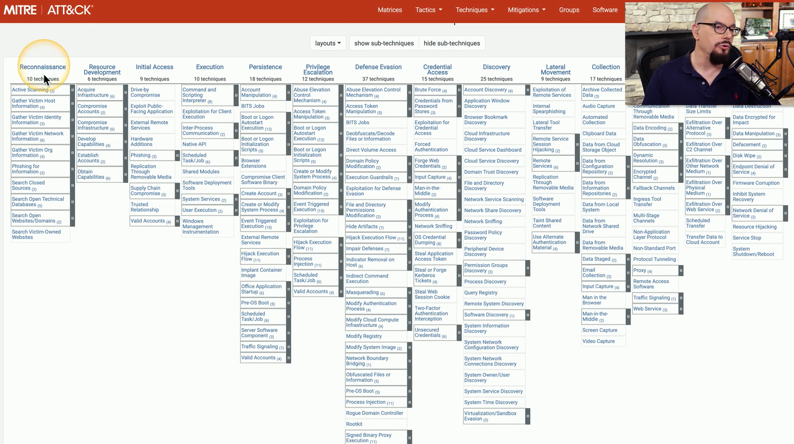
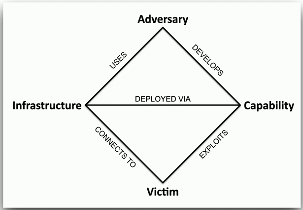
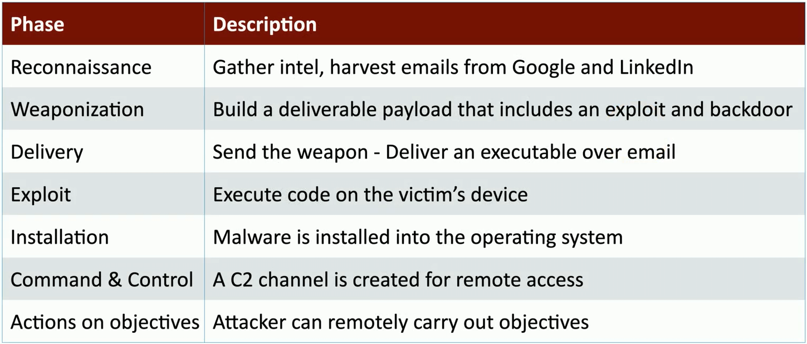

## Attacks and responses
- A constantly moving chessboard
	- The rules are also constantly changing
- Response and intelligence teams need assistance
	- Gather and maintain ongoing reconnaissance
- Understand attacks
	- Many different vectors
- Assess the risk in an organization
	- Determine if a risk exists
	- Use appropriate mitigation
## MITRE ATT&CK Framework
- The MITRE corporation
	- US not-for-profit based in Massachusetts and Virginia
	- Supports several U.S. government agencies
- The MITRE ATT&CK framework
	- https://attack.mitre.org/
- Determine the actions of an attacker
	- Identify point of intrusion
	- Understand methods used to move around
	- Identify potential security techniques to block future attacks

## Diamond Model of Intrusion Analysis
- Designed by the intelligence community
	- https://apps.dtic.mil/docs/citations/ADA586960
		- Guide analysts to help understand intrusions
		- Integrates well with other frameworks
- Apply scientific principles to intrusion analysis
		- Measurement
		- Testability
		- Repeatability
	- Appears simple, but is remarkably complex
- An adversary deploys a capability over some infrastructure against a victim
	- Use the model to analyze and fill in the details
## The Diamond Model

## Cyber Kill Chain
- Seven phases of a cyber attack
	- A military concept

